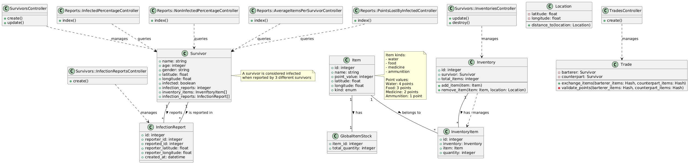

# Challenge 1

[ZSSN (Zombie Survival Social Network)](docs/challenge.md)

## Step 1

### Modelagem do Projeto com Diagramas de Código

Para este projeto, utilizaremos diagramas de código (code.puml) como nossa principal ferramenta de modelagem. Embora existam vários tipos de diagramas UML disponíveis (como diagramas de classe, diagramas de sequência, diagramas de atividade, etc.), optamos por focar em diagramas de código pelos seguintes motivos:

1. **Representação Direta do Código**: Os diagramas de código fornecem uma representação clara e direta da estrutura real do código, facilitando a compreensão dos detalhes de implementação.

2. **Manutenibilidade**: À medida que o código evolui, os diagramas de código são mais fáceis de manter e atualizar, pois refletem diretamente o código-fonte.

3. **Amigável para Desenvolvedores**: Os diagramas de código são mais familiares para os desenvolvedores, pois se assemelham muito à estrutura real do código, reduzindo a curva de aprendizado.

4. **Foco na Implementação**: Ao usar diagramas de código, podemos focar melhor nos detalhes de implementação e garantir que nosso design esteja alinhado com a estrutura real do código.

O arquivo code.puml servirá como nossa documentação principal para a arquitetura e detalhes de implementação do projeto.

### Diagramas do Sistema

O diagrama do sistema pode ser encontrado em [docs/code.puml](docs/code.puml) e sua representação visual está disponível abaixo:

Para "rodar" o projeto: [Plant UML em Docker](https://plantuml.com/starting)

## Run app com docker

- Necessário ter o `docker` e `docker compose`
- Para instalação docker e docker compose acesse: [DOCKER](https://docs.docker.com/engine/install/ubuntu/), [POST-INSTALL](https://docs.docker.com/engine/install/linux-postinstall/), [DOCKER COMPOSE](https://docs.docker.com/compose/)
- Versão docker e docker compose que foi relaizado a primeira configuração: `Docker version 28.1.1, build 4eba377`, `Docker Compose version v2.35.1`

- Clone o projeto, na raiz do projeto rode `docker compose up`
- Estará rodando em `http://0.0.0.0:3002/`
- Para executar os testes: `docker compose exec api_zssn bin/rspec`

## Documentação da API

A documentação da API está disponível através do Swagger UI. Para acessar:

1. Com a aplicação rodando, acesse: `http://localhost:3002/api-docs`
2. A documentação interativa permite:
   - Visualizar todos os endpoints disponíveis
   - Testar as requisições diretamente pela interface
   - Ver os modelos de dados e suas propriedades
   - Entender os códigos de resposta possíveis

# ZSSN API

## Passos de Desenvolvimento e Decisões Técnicas

### 1. Design Inicial e Modelagem de Dados
- Criação do diagrama UML (code.puml) definindo a estrutura do sistema
- Definição das entidades principais: Survivor, Inventory, Item, InfectionReport e Trade
- Estabelecimento das regras de negócio para infecção (3 relatórios = infectado)
- Definição do sistema de pontos para itens (água: 4, comida: 3, medicina: 2, munição: 1)

Commit: [`fdab542`](https://github.com/HDias/zssn/commit/fdab542) - docs: create code.puml code design

### 2. Configuração Inicial do Projeto
- Inicialização do projeto Rails 8 com configuração RSpec
- Configuração do ambiente Docker para desenvolvimento
- Migração do SQLite para PostgreSQL

Commit: [`bff95f1`](https://github.com/HDias/zssn/commit/bff95f1) - chore: start a empty rails 8 app with rspec config

Commit: [`dd0b171`](https://github.com/HDias/zssn/commit/dd0b171) - chore: config docker

Commit: [`fa2aceb`](https://github.com/HDias/zssn/commit/fa2aceb) - refactor: remove sqlite and add pg gem

### 3. Implementação das Funcionalidades Principais
#### Sobreviventes (Survivors)
- Criação do modelo Survivor com validações de localização
- Implementação do sistema de notificação de infecção
- Adição de inventário vazio após criação do sobrevivente
- Endpoint para atualização de localização

Commit: [`b87d3fc`](https://github.com/HDias/zssn/commit/b87d3fc) - feat: create tables survivors and infection_report

Commit: [`6c3a1f0`](https://github.com/HDias/zssn/commit/6c3a1f0) - feat: create models survidor and infection and specs

Commit: [`c1f5810`](https://github.com/HDias/zssn/commit/c1f5810) - feat(infection_reports): add controller to notify infection and add spectations

Commit: [`a7e3a87`](https://github.com/HDias/zssn/commit/a7e3a87) - feat(survivor): add action to create

Commit: [`11e7329`](https://github.com/HDias/zssn/commit/11e7329) - feat(survivor): add action to update location params

#### Inventário (Inventory)
- Criação do sistema de inventário com itens
- Implementação de endpoints para adicionar e remover itens
- Integração com o sistema de pontos
- Validações de quantidade e tipos de itens

Commit: [`aac573e`](https://github.com/HDias/zssn/commit/aac573e) - feat(inventory): create tables and models to provide data

Commit: [`37b78e8`](https://github.com/HDias/zssn/commit/37b78e8) - feat(inventory): add_items

Commit: [`cbb3b46`](https://github.com/HDias/zssn/commit/cbb3b46) - feat(inventory): remove item

Commit: [`418c983`](https://github.com/HDias/zssn/commit/418c983) - feat(survivor): add empty inventory after create

Commit: [`3c460bd`](https://github.com/HDias/zssn/commit/3c460bd) - feat(inventory): add endpoitn to add item to survivor inventory'

Commit: [`07dd8f2`](https://github.com/HDias/zssn/commit/07dd8f2) - feat(inventory): add action destory to remove item from survivor inventory

#### Sistema de Comércio (Trade)
- Implementação das regras de troca
- Validação de pontos equivalentes
- Endpoint para realização de trocas
- Sistema de verificação de itens disponíveis

Commit: [`d0434ed`](https://github.com/HDias/zssn/commit/d0434ed) - feat(trade): create core trade with rules

Commit: [`5f2e7f5`](https://github.com/HDias/zssn/commit/5f2e7f5) - feat(trade): create endpint to trade

#### Relatórios (Reports)
- Implementação de endpoints para estatísticas:
  - Percentual de infectados
  - Percentual de não infectados
  - Média de itens por sobrevivente
  - Pontos perdidos por infectados

Commit: [`fc52b0c`](https://github.com/HDias/zssn/commit/fc52b0c) - feat(reports): create reports controllers

### 4. Melhorias e Refatorações
- Refatoração do modelo Survivor para Active Record
- Otimização das associações entre modelos
- Melhoria na estrutura de rotas
- Ajustes nas validações e regras de negócio

Commit: [`a6a7ba9`](https://github.com/HDias/zssn/commit/a6a7ba9) - fix: change data modeling

Commit: [`eff1c83`](https://github.com/HDias/zssn/commit/eff1c83) - refactor: change survivor class to a active record and refactor associations and specs

Commit: [`2c1182e`](https://github.com/HDias/zssn/commit/2c1182e) - fix: routes

### 5. Decisões Técnicas Importantes
- Uso de counter_cache para contagem de relatórios de infecção
- Sistema de pontos para balanceamento de trocas
- Estrutura modular para relatórios estatísticos

### 7. TODO: Implementação da Classe Location
- Criar classe Location para encapsular lógica de localização
- Implementar método `distance_to` para calcular distância entre duas localizações
- Adicionar validações de proximidade para:
  - Troca de itens entre sobreviventes (deve estar próximo)
  - Coleta de itens (deve estar próximo ao item)
  - Relatórios de infecção (deve estar próximo ao reportado)
- Definir raio máximo de interação (ex: 100 metros)
- Implementar testes para validações de proximidade
- Adicionar documentação sobre as regras de proximidade
- Considerar uso de geocoding para validações mais precisas
- Implementar cache de cálculos de distância para otimização

